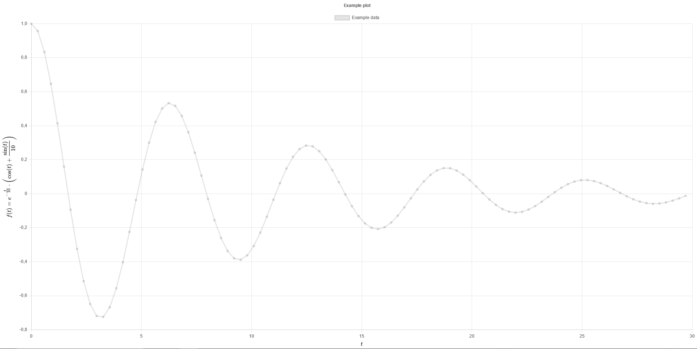

# chartjs-plugin-texaxes
Chart.js plugin to add support for TeX style axes titles

## Usage

Chart.js version when writing: v3.8.0

1. Load MathJAX v3.0+ library with tex input and svg output option (see Examples).
2. Load plugin.
3. Set axes titles in the plugin options (see Examples).

Be aware to use double backslash (`\\`) in the title strings when appropriate! For example, to get TeX `sin` function, it has to be written as `\\sin` and NOT `\sin` inside the title string!

Also, don't use or disable `scale.title` option!

## Options

Following table contains the available options for the plugin. Options `xTitle` and `yTitle` are mandatory. It is also most likely neccessary to specify `xScaleID` and `yScaleID`, so that they match your scale IDs.

| Option  | Type | Default value | Description |
| -- | :--: | -- | -- |
| xTitle | string | 'none'  | x-Axis title in TeX format |
| yTitle | string | 'none'  | y-Axis title in TeX format |
| xScaleID  | string | 'xAxis'  | ID of x-Scale |
| yScaleID | string | 'yAxis'  | ID of y-Scale |
| texOptions | object | {em: 10, ex: 5, display: true}  | Settings for MathJAX renderer |
| padding | object | {inner: 5, outer: 5}   | Padding. Inner for amount of pixels between the title of axis and scale. Outer for amount of pixels between axis title and chart outer border |

## Example

Example of HTML file HEAD:
```html
<script>
MathJax = {
	tex: {},
	svg: {
		fontCache: 'local'
	}
};
</script>

<!-- Load MathJAX required for this plugin, (tex input, svg output) variant -->
<script src="https://polyfill.io/v3/polyfill.min.js?features=es6"></script>
<script src="https://cdn.jsdelivr.net/npm/mathjax@3.2.2/es5/tex-mml-svg.js"></script>

<!-- Load plugin script -->
<script src="chartjs-plugin-texaxes.js"></script>
```

Example of usage in Javascript script:
```javascript
const pltConfig = {
	type: "line",
	data: {
		datasets: datasets,
	},
	options: {
		scales: {
			xAxis: {
				type: 'linear',
			},
			yAxis: {
				type: 'linear',
			}
		},
		plugins: {
			texaxes: {
				xTitle : "t",
				yTitle : "f(t) = \e^{-\\frac{t}{10}} \\cdot \\left( \\cos (t) + \\frac{\\sin(t)}{10} \\right)",
			}
		}
	}
}

const myChart = new Chart(
	document.getElementById('mainCanvas'),
	pltConfig
);
```

## Screenshots


